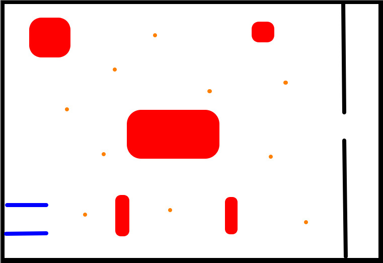
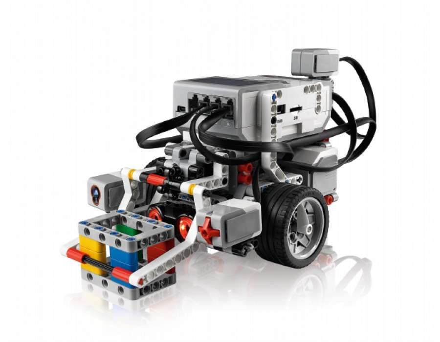

2 months ago I was approached by my local 4H programs agent, and she asked me if I would like to help teach their 
robotics program.

Being me, I said yes.

If you don't know, 4H is a program supported by the USDA, mostly known for its stock shows. 
4H also has programs for other activities. Some examples being cooking, photography, shooting sports, 
and sewing to name a few. But when you think of 4H normally you think of the stock show programs, which is fair. 
I come from a small town and a lot of the people I know show animals. I almost did show a calf about 4 years ago.

It didn't work out. But that story is for another day.

## So, what happened?

Before the juicy stuff, it was really cool getting to teach kids robotics, and programming. Because the 4H Robotics program was how I 
got my start in robotics and programming. About 5 years ago, I did a First Lego League competition as a part of 4H, 
_which we were very unprepared for._ But this year instead of FLL we used the leftover Lego Mindstorms EV3 kits, to 
teach the basics of engineering and programming. 

## Why Mindstorms?
Lego Mindstorms was a great choice over something like Vex IQ, Tetrix, or Arduino. Because of it being easy to build 
with for kids of such young age (the range group was 4th through 6th, I am in 8th as of writing), and the programming 
was with EV3's Block Programming Language, which also was great since young kids have troubles with text based languages.

## The Challenge
The challenge for the kids was to gather cows (the game had a farm theme) and bring them to a cage. The layout however
had obstacles that if the robot hit, they would lose points. Whoever got the most points won, and got a prize of a high five.
(We really went all out with the prize this time.)

A picture of the layout is below

_Red represents the obstacles, orange represents the cows, and between the blue is where the robot has to start. The 
cows have to be brought to the gate on the right._

## Engineering
For the first 3 weeks out of 6 weeks of meeting, we built the standard EV3 robot. A picture of the robot we built is below.

After building the base robot, the kids had to design an arm or device that can grab cows. Which gave us many
interesting designs. The designs ranged from just 2 pieces that could hold the cows while they turned, to an arm that grabbed 
the cows by the arm moving down and gripping at the same time, similar to a claw machine.

## Programming
For the last 3 weeks, the kids had to program the path and their arms. We introduced programming with OzoBot, and its 
path game. OzoBot has a system where it will follow a black line, but it will follow instructions by color codes, so it 
could speed up, slow down, spin, turn left, increment the counter (intro to variables), and a lot more. We made a maze 
where the kids had to find an optimized path that would go through certain points, the fastest they can. And it was a 
good intro. They found the quickest path by measuring the line with a yard stick, that's an idea I had never thought of 
that the kids figured out.

After the basics with OzoBot, we taught that programming isn't, *hacking into the **FBI***, or *going through **3D 
Vector Matrices***. And that it's just a list of instructions. Which was massively simplified due to the EV3 Block 
Language. Which made it just instructions with more detail. After which the kids learned surprisingly fast. One kid even
asked me if he could do a text language. A group made their own obstacle course while they waited for their turn at the
table. It was genuinely impressive.

## Final Notes
We did make sure to embrace FIRST's 'Gracious Professionalism' theme, because of positivity that phrase has in the engineering space. 
Having teams share ideas yet still be competitive, made some great designs and ideas.

I have to thank some people, 4H and their agent for actually running it. A person who I'm not naming to respect their 
privacy, who actually headed the program. I just assisted with the teaching. (They'll know if it's them if their reading 
this). And, said persons mom for keeping the kids from going wild.

Thanks.

